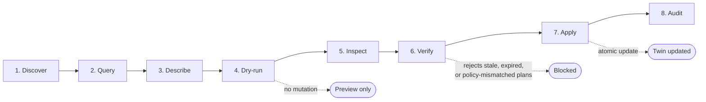
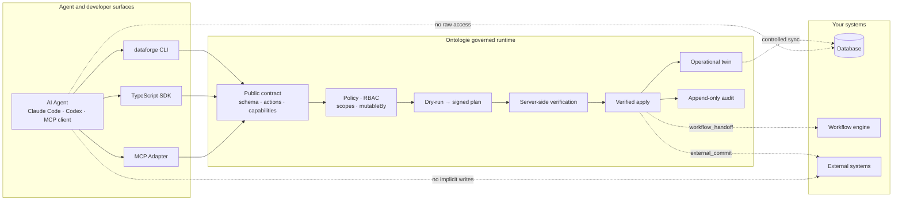
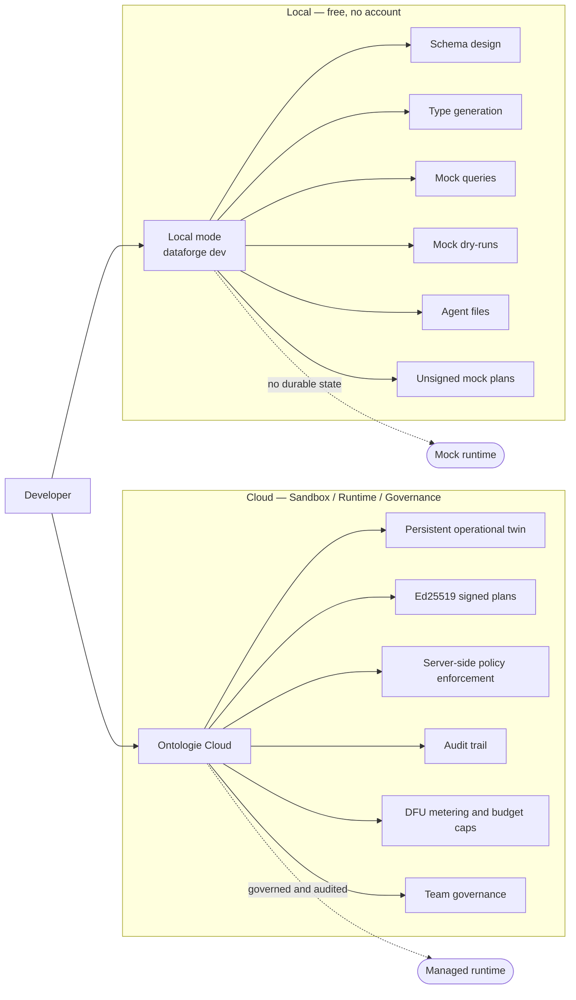

# Ontologie

**The governed backend for AI agents — built by [Growthsystemes](https://www.growthsystemes.com/).**

Typed business objects, graph context, bounded actions, dry-runs, signed plans, and audit — without exposing your database.

The product is Ontologie. The CLI command and npm package namespace are `dataforge`.

---

## Why Ontologie

Most software exposes the wrong interface to agents:

- Raw databases bypass business rules
- CRUD APIs allow arbitrary writes
- Prompt-only rules are hard to audit
- MCP wrappers often expose too much power

Ontologie gives agents a safer contract:

- **Typed business objects** instead of tables
- **Declared links** instead of implicit joins
- **Bounded actions** instead of arbitrary writes
- **Dry-runs** before mutation
- **Signed plans** before apply
- **Server-side policy enforcement**
- **Audit trails** for every business change

---

## Quickstart

```bash
npm install -g @dataforge/cli
dataforge init --template contract-review
cd contract-review
dataforge dev
```

In another terminal:

```bash
dataforge schema describe --format json
dataforge query Contract --format json
dataforge actions describe Contract.approve --format json
dataforge actions run Contract.approve con_001 --dry-run --format json
dataforge plan inspect <planId> --format markdown
dataforge actions run Contract.approve con_001 \
  --apply-plan <planId> \
  --idempotency-key approve-con-001 \
  --format json
```

See the full [Quickstart guide](QUICKSTART.md) for local and cloud walkthroughs.

---

## The safety loop

Every mutation follows the same loop:

1. **Discover** schema and actions
2. **Query** current state
3. **Describe** the action
4. **Dry-run** the mutation
5. **Inspect / verify** the signed plan
6. **Apply** the verified plan with an idempotency key



At apply time, the runtime verifies actor, workspace, action, inputs, object versions, schema version, policy version, expiry, and idempotency before writing anything.

---

## Minimal model

```typescript
import {
  objectType, string, number, date, enumType,
  action, role, now, compile,
} from '@dataforge/schema';

const ContractStatus = enumType('ContractStatus', [
  'draft', 'pending_review', 'approved', 'rejected',
]);

const Client = objectType('Client', {
  name: string().required().indexed(),
});

const Contract = objectType('Contract', {
  reference: string().required().indexed(),
  amount: number(),
  status: ContractStatus.default('draft')
    .mutableBy(['Contract.approve', 'Contract.reject']),
  approvedAt: date().optional()
    .mutableBy(['Contract.approve']),
});

const approveContract = action('approve')
  .on(Contract)
  .executionMode('twin_apply')
  .requires(role('manager'))
  .when(c => c.status.eq('pending_review'))
  .set({ status: 'approved', approvedAt: now() });

export const manifest = compile([Client, Contract], {
  actions: [approveContract],
});
```

Fields protected by `mutableBy` cannot be changed through raw writes. The server rejects unauthorized mutations with `WRITE_POLICY_VIOLATION`.

See the full [contract-review example](examples/contract-review/) with seed data, agent files, and expected plan output.

---

## Surfaces

| Surface | Use case | Stability |
|---------|----------|-----------|
| **CLI** (`@dataforge/cli`) | Agents, CI, scripts | Stable |
| **SDK** (`@dataforge/sdk-client`) | TypeScript / Node.js apps | Stable |
| **MCP** (`@dataforge/mcp`) | Claude Code, Codex, MCP clients | Preview |

The CLI is the canonical contract. SDK and MCP expose the same capabilities with the same scopes, policies, signed plans, and audit. The MCP adapter never has more power than the CLI.

Works with Claude Code, Codex, any MCP client, and regular CLI/CI workflows.

---

## Architecture



---

## Local vs Cloud

**Local** is free and accountless: schema authoring, code generation, mock queries, mock dry-runs, and agent instruction files.

**Ontologie Cloud** adds persistent state, signed plans (Ed25519), policy enforcement, audit, quotas, team governance, and production execution.



See [Local vs Cloud](docs/local-vs-cloud.md) for a detailed comparison.

---

## Security

Agent safety is enforced at the runtime layer, not through prompt instructions.

- Agents discover a typed schema — no raw database access
- Scoped API keys (server-side only) and OAuth PKCE (browser)
- Dry-run before mutation, signed plan before apply
- Server-side policy enforcement and per-field write control (`mutableBy`)
- Idempotency keys on every apply
- Append-only audit trail with principal type, action, plan reference

See [Signed plans and safety](docs/signed-plans-and-safety.md) and [SECURITY.md](SECURITY.md) for details.

---

## Pricing

Free locally. Free cloud sandbox. Prepaid cloud runtime for production.

| Plan | Price | DFU / month |
|---|---:|---:|
| **Local Free** | Free, no account | Not metered |
| **Cloud Sandbox** | Free, no card | 10K (hard cap) |
| **Cloud Runtime** | Prepaid DFU packs | Budget-capped |
| **+ Governance** | Per workspace/mo | — |
| **Enterprise** | Contract | Custom |

Cloud Sandbox is hard-capped. No overages. No surprise bills. See [Billing and limits](docs/billing-and-limits.md) for DFU details and tier comparison.

---

## What Ontologie is NOT

- Not a workflow engine — use `workflow_handoff` to delegate orchestration
- Not a data warehouse — it governs operational state, not analytical queries
- Not a generic CRUD API — mutations go through bounded actions and signed plans
- Not self-hosted — CLI/SDK are open-source (MIT); the cloud runtime is managed

---

## Install

```bash
# CLI
npm install -g @dataforge/cli

# SDK
npm install @dataforge/sdk-client @dataforge/schema

# Mock server (local dev)
npm install --save-dev @dataforge/mock-server

# MCP adapter (Preview)
npm install @dataforge/mcp
```

---

## Read next

- [Quickstart](QUICKSTART.md) — first result in under 10 minutes
- [Concepts](docs/concepts.md) — primitives and mental model
- [CLI contract](docs/cli-contract.md) — JSON envelope, exit codes, flags
- [SDK guide](docs/sdk-guide.md) — TypeScript integration
- [Signed plans and safety](docs/signed-plans-and-safety.md) — the core safety mechanism
- [MCP guide](docs/mcp-guide.md) — adapter configuration for Claude Code, Codex

Full reference: [Schema DSL](docs/schema-dsl-reference.md) · [Query](docs/query-reference.md) · [Errors](docs/errors.md) · [Auth](docs/auth-and-scopes.md) · [RBAC](docs/rbac-and-roles.md) · [Policy](docs/policy-reference.md) · [Import/Export](docs/import-export-reference.md) · [Audit](docs/audit.md) · [Billing](docs/billing-and-limits.md) · [Stability](docs/stability-and-versioning.md) · [Roadmap](docs/roadmap.md) · [FAQ](docs/faq.md)

---

## About Growthsystemes

Ontologie is developed and operated by [Growthsystemes](https://www.growthsystemes.com/), the team behind the Ontologie platform for operational AI systems.

**Authors:** Quentin Gavila & Benoit Ferrere

---

## License

MIT for public SDK and CLI packages. Ontologie Cloud is a managed commercial service.
